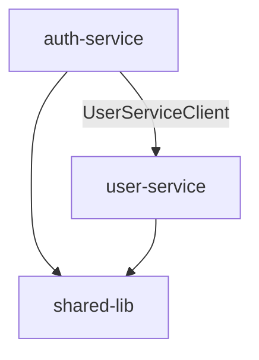

# Repo to Obsidian

Orchestrates two sub-skills to transform any code repository into a fully linked Obsidian vault:

1. **`repo-architecture-analyzer`** — analyzes the codebase and builds the architecture model
2. **`obsidian-markdown`** — defines how to format and link Obsidian notes correctly

**REQUIRED SUB-SKILLS:** Invoke both before starting:
- `repo-architecture-analyzer`
- `obsidian-markdown`

---

## Modes

This skill operates in two modes. Determine which mode to use based on the user's request:

| Mode                 | When to use                                                                                                                                             |
| -------------------- | ------------------------------------------------------------------------------------------------------------------------------------------------------- |
| **GENERATE**         | User wants to document a repo for the first time, or re-generate the full vault                                                                         |
| **FEATURE PLANNING** | User wants to plan a new feature, update the vault with draft notes, or mark drafts as implemented                                                      |
| **ATTESTATION**      | User wants to verify that existing vault notes are still accurate and in sync with the current codebase. Also runs automatically at the end of PROMOTE. |

---

## Vault / Repo Separation (Important Setup Advice)

Before starting any work, if the user has not yet set up their vault location, recommend this structure:

```
my-project/           <- your repository (git)
my-project-vault/     <- your Obsidian vault (separate folder, NOT inside the repo)
  _index.md
  components/
  services/
  ...
  _features/          <- draft feature plans live here
    my-feature/
      _plan.md
      EntityA.draft.md
      EntityB.draft.md
```

**Why keep them separate:**

- The vault is documentation/planning tooling, not source code — it should not be committed with the repo unless intentional.
- Obsidian settings (`.obsidian/`) create their own git history, which pollutes the repo log.
- Allows the vault to survive repo refactors without merge conflicts.

**How to link them without merging:**

- In Obsidian settings → Files & Links → set "New link format" to "Relative path from vault root"
- The vault refers to source files via `file:` frontmatter field (relative path from repo root) — this is a human reference, not a live link
- Optionally: add the vault folder path to `.gitignore` in the repo, and version the vault separately with its own git repo

If the user asks to save/export the vault after generation, copy the vault output folder to the desired location outside the repo.

---

## Multi-Repo Vault (Cross-Repository Links)

A single shared vault can contain multiple repositories, one folder per repo. This is the **recommended structure** for backend ecosystems where services share common libraries or call each other.

### Vault Structure

```
shared-vault/               <- one Obsidian vault for all repos
  _index.md                 <- top-level index: shows cross-repo dependencies
  auth-service/             <- one folder per repo
    _index.md
    services/
    models/
    ...
  user-service/
    _index.md
    services/
    models/
    ...
  shared-lib/
    _index.md
    utils/
    types/
    ...
  _features/                <- feature plans (may span multiple repos)
```

### Cross-Repository Linking Rules

When analyzing a repository and you detect an import or dependency that **refers to another repository already present in the vault**, you **must** link to it using a path-based wikilink:

```
[[other-repo/EntityName]]
```

Example: if `auth-service` imports `UserRepository` from `shared-lib`, write:

```markdown
## Dependencies

- [[shared-lib/UserRepository]] — used for reading user records
```

**How to detect cross-repo dependencies:**

- Look for imports from package names that correspond to other repos in the vault (e.g., `@company/shared-lib`, `../shared-lib/...`, or named module aliases)
- Look for HTTP client calls to services by name (e.g., `UserServiceClient`, `fetch('http://user-service/...')`)
- Look for shared type imports from a common types package

**If the referenced repo is NOT yet in the vault:**

- Do NOT create a dangling link
- Instead, add a `> [!NOTE]` callout in the Dependencies section: `External dependency on \`shared-lib\` (not yet documented in this vault)`

### Top-Level `_index.md`

When the vault contains (or will contain) multiple repos, create a root-level `_index.md` that shows the full cross-repo dependency graph:

````markdown
---
title: Architecture Overview
type: vault-index
tags: [architecture, index, multi-repo]
---

# Shared Architecture Vault

> Overview of all documented repositories and their interdependencies.

## Repositories

| Repo                                  | Description                 | Notes |
| ------------------------------------- | --------------------------- | ----- |
| [[auth-service/_index\|auth-service]] | Authentication and sessions | ...   |
| [[user-service/_index\|user-service]] | User profiles               | ...   |
| [[shared-lib/_index\|shared-lib]]     | Common utilities and types  | ...   |

## Cross-Repository Dependencies


````

## Shared Entities

| Entity                        | Used by                                                    |
| ----------------------------- | ---------------------------------------------------------- |
| [[shared-lib/UserRepository]] | [[auth-service/AuthService]], [[user-service/UserService]] |

````

### When Adding a New Repo to an Existing Vault

1. Create the subfolder `vault/<repo-name>/`
2. Run the standard GENERATE flow, scoped to that subfolder
3. After analysis: check all cross-repo imports — link to already-documented repos
4. Update the root `_index.md`: add the new repo to the table and update the Mermaid graph
5. Update notes in other repos: if they import from the new repo, replace `> [!NOTE] External dependency` callouts with proper `[[new-repo/EntityName]]` wikilinks

---

## GENERATE Mode

### Step 0 — Confirm Setup

**Always ask these questions before starting** (skip only if already answered in the conversation):

1. **Repo path** — where is the repository?
2. **Vault output path** — where to write the Obsidian vault?
   - Default: a folder named `<project-name>-vault/` **alongside** (not inside) the repo
   - Remind the user to keep this outside the repo (see Vault/Repo Separation above)
3. **Multi-repo vault?** — does this vault already contain other repos, or will it?
   - If yes: notes go into `vault/<repo-name>/` subfolder, not the vault root
   - If yes: ask which other repos are already in the vault so cross-repo links can be resolved
4. **Language** — what language should notes be written in?
   - Always ask explicitly. Do not assume. Suggest Ukrainian as default.
   - Examples: Ukrainian, English, Polish, etc.

Then confirm before proceeding:
> "I'll analyze the repo at `<path>` and write Obsidian notes to `<vault-path>/<repo-name>/`. Notes will be written in **<language>**. Cross-repo links to already-documented repos will be resolved. Ready?"

---

### Step 1 — Run Architecture Analysis

Follow the complete workflow defined in **`repo-architecture-analyzer`**:

- Phase 1: Project identification
- Phase 2: Entity discovery
- Phase 3: Entity analysis (responsibility, public API, dependencies)
- Phase 4: Dependency graph + clusters
- Phase 5: Architecture summary

Keep the full analysis result in memory — it drives all note generation in Step 2.

> [!IMPORTANT]
> Complete the entire analysis before writing a single note file.
> Accuracy of wikilinks depends on having the full entity list upfront.

---

### Step 2 — Generate Obsidian Notes

Using the analysis from Step 1 and formatting rules from **`obsidian-markdown`**, generate one `.md` file per entity.

#### Note Template

Apply the exact template below for every entity. Fill each section from the analysis data.

```markdown
---
title: <EntityName>
type: <entity-type>
status: implemented
entry_point: true        ← include ONLY if this entity is an entry point; omit field entirely otherwise
file: <relative-file-path>
language: <language>
framework: <framework or "none">
tags: [architecture, <entity-type>]
---

# <EntityName>

> <one-sentence responsibility>

## Overview

<2-4 paragraphs: what it does, why it exists, how it fits the overall system,
which design pattern it follows (if any). Write for a developer new to the codebase.
Use [[wikilinks]] when naming other entities inline.>

## Public API

| Name | Signature / Type | Description |
|------|-----------------|-------------|
| ... | ... | ... |

If there are fewer than 3 items, use a list instead of a table.

## Dependencies

> What this entity uses from the rest of the codebase.

- [[EntityA]] — <reason>

(Write `_none_` if there are no internal dependencies.)

## Dependents

> What uses this entity.

- [[EntityC]] — <how it uses this entity>

(Write `_none_` if nothing depends on this entity.)

## Data Flow

<Include only when meaningful. Use Mermaid flowchart or numbered steps.>

## Notes

<Edge cases, TODOs found in code, design decisions. Omit if nothing to add.>
````

#### File Placement

**Single-repo vault:**

```
vault/
├── _index.md
├── _features/
├── components/
├── services/
├── models/
├── controllers/
├── stores/
├── hooks/
├── utils/
├── types/
├── modules/
└── config/
```

**Multi-repo vault (recommended for backend ecosystems):**

```
shared-vault/
├── _index.md             <- top-level cross-repo index
├── _features/
├── <repo-name>/
│   ├── _index.md
│   ├── services/
│   ├── models/
│   ...
└── <other-repo>/
    ├── _index.md
    ...
```

If the vault already contains other repos, place notes under `vault/<repo-name>/` and link cross-repo entities with `[[repo-name/EntityName]]`.

#### Linking Rules

- Use `[[EntityName]]` for entities within the same repo
- Use `[[repo-name/EntityName]]` for entities in other repos already documented in the vault
- All links must be bidirectional: if A depends on B, then B lists A as a dependent (even across repos)
- Verify all `[[links]]` resolve to a real note before writing; if the target repo is not yet in the vault, use a `> [!NOTE]` callout instead of a dangling link
- Link inline in Overview text, not just in the Dependencies section

---

### Step 3 — Generate Index Note

Create `vault/_index.md`:

```markdown
---
title: <ProjectName> Architecture
type: index
tags: [architecture, index]
---

# <ProjectName> — Architecture Map

> <One paragraph: what the project does, its tech stack, scale.>

## Tech Stack

| Layer | Technology |
| ----- | ---------- |
| ...   | ...        |

## Architecture Overview

<2-3 paragraphs on overall style, data flow, main layers.>

## Entry Points

> Services / modules that are the main starting point of execution within their folder or subsystem.

| Entity      | Responsibility |
| ----------- | -------------- |
| [[EntityA]] | ...            |

## Entity Map

| Entity      | Type    | Status      | Responsibility |
| ----------- | ------- | ----------- | -------------- |
| [[EntityA]] | service | implemented | ...            |

## Key Dependency Clusters

- **<ClusterName>**: [[A]], [[B]], [[C]] — <what they do together>

## Data Flow

<3-5 step system flow from architecture summary.>

## Planned Features (Drafts)

_No draft features yet._
```

---

### Step 4 — Final Verification

- [ ] Every entity mention in note bodies is a `[[wikilink]]`
- [ ] All wikilinks resolve to a real note (same-repo or `[[repo-name/Entity]]`)
- [ ] Cross-repo imports detected and linked to existing vault repos (or noted with `> [!NOTE]` if not yet documented)
- [ ] Bidirectional links correct (Dependencies <-> Dependents), including across repos
- [ ] All frontmatter valid YAML, no empty fields
- [ ] All notes have `status: implemented`
- [ ] Mermaid diagrams syntactically valid
- [ ] Per-repo `_index.md` lists every entity in that repo
- [ ] Root `_index.md` updated with cross-repo dependency graph (if multi-repo vault)
- [ ] Entry point entities have `entry_point: true` in frontmatter; non-entry-point entities have NO `entry_point` field at all
- [ ] All `entry_point: true` entities appear in the **Entry Points** section of `_index.md`

---

### Step 5 — Report to User

```
Vault generated at: <vault-path>/

Summary:
  - X notes created
  - Y dependency links
  - Z clusters identified

Structure:
  vault/
  ├── _index.md
  ├── components/  (N files)
  ├── services/    (N files)
  ...

Suggested starting points:
  - [[EntryPointA]] — <why>

To save the vault:
  Copy the <vault-path>/ folder outside the repo.
  Open it in Obsidian via "Open folder as vault".
```

---

## FEATURE PLANNING Mode

Use when the user wants to plan a new feature, add draft notes to an existing vault, or mark a drafted feature as implemented.

Three sub-modes:

| Sub-mode    | Trigger examples                                                                     |
| ----------- | ------------------------------------------------------------------------------------ |
| **DRAFT**   | "plan a new feature", "add feature X to the vault"                                   |
| **PROMOTE** | "promote draft \<feature-name\>", "mark feature as implemented", "feature X is done" |
| **UPDATE**  | "re-sync vault after refactor", "update vault with new changes"                      |

---

### DRAFT Sub-mode

#### Step FP-0 — Confirm Setup

Ask (skip if already stated):

1. **Vault path** — where is the existing vault?
2. **Repo path** — where is the repo?
3. **Feature name** — e.g. `user-notifications`
4. **Feature description** — what should this feature do?
5. **Language** — always ask explicitly

Confirm:

> "I'll plan the `<feature-name>` feature as draft notes in `<vault-path>/_features/<feature-name>/`. All notes will be marked DRAFT. Ready?"

#### Step FP-1 — Analyze Existing Architecture

1. Read vault `_index.md` for current entities and clusters
2. Scan existing vault notes: entity names, `type`, `status`, dependencies
3. Run lightweight repo analysis (Phase 1-2 of `repo-architecture-analyzer`) to confirm current state

Build an **existing entities map** in memory: `{ EntityName -> { type, file, status } }`

#### Step FP-2 — Plan and Confirm with User

Based on feature description + existing architecture, identify:

1. Existing entities that will be **modified or called**
2. New entities that need to be **created**
3. Integration points between new and existing entities

Present to user **before writing any files**:

```
Feature Plan: <feature-name>

Existing entities to modify:
  - [[EntityA]] — <what changes and why>

New entities to create:
  - <NewService> (service) — <responsibility>
  - <NewComponent> (component) — <responsibility>

Integration points:
  - <NewService> will depend on [[EntityA]]
  - [[EntityB]] will call <NewComponent>

Does this look right?
```

**Wait for user confirmation before proceeding.**

#### Step FP-3 — Generate Draft Notes

**Location:** `vault/_features/<feature-name>/`

**Feature plan note** — `_plan.md`:

```markdown
---
title: "Feature: <feature-name>"
type: feature-plan
status: draft
tags: [feature, draft, <feature-name>]
created: <YYYY-MM-DD>
---

# Feature: <feature-name>

> [!WARNING]
> **DRAFT** — Planned but not yet implemented in the codebase.

## Description

<user's feature description>

## Affected Existing Entities

| Entity      | Change         |
| ----------- | -------------- |
| [[EntityA]] | <what changes> |

## New Entities

| Entity         | Type    | Responsibility   |
| -------------- | ------- | ---------------- |
| [[NewService]] | service | <responsibility> |

## Implementation Notes

<architectural notes, open questions>

## Status

- [ ] Planned
- [ ] In Progress
- [ ] Implemented (run "promote draft <feature-name>" when done)
```

**New entity notes** — standard template with these changes:

```markdown
---
title: <EntityName>
type: <entity-type>
status: draft
feature: <feature-name>
file: <planned path — does not exist yet>
tags: [architecture, <entity-type>, draft, <feature-name>]
---

# <EntityName>

> [!WARNING]
> **DRAFT** — Planned but not yet implemented. Part of feature [[_features/<feature-name>/_plan|<feature-name>]].

> <one-sentence responsibility>

## Overview

...
```

**Amendment notes** — for each existing entity to be modified, create `<EntityName>.amendment.md`:

```markdown
---
title: "<EntityName> — <feature-name> amendment"
type: amendment
status: draft
amends: "[[<EntityName>]]"
feature: <feature-name>
tags: [amendment, draft, <feature-name>]
---

# Amendment: [[<EntityName>]] for <feature-name>

> [!WARNING]
> **DRAFT** — These changes are planned but not yet implemented.

## Planned Changes

<new methods, new dependencies, behavior changes>

## New Dependencies Added

- [[NewService]] — <reason>

## New Dependents Added

- [[NewComponent]] — <reason>
```

#### Step FP-3b — Back-link Original Notes

For each existing entity note that received an `.amendment.md`, update the **original note** in the main vault folder:

1. Add `amendment` field to frontmatter:
   ```yaml
   amendment: "[[_features/<feature-name>/<EntityName>.amendment|<feature-name>]]"
   ```
2. Add a `> [!WARNING]` callout at the very top of the note body (right after the one-sentence responsibility blockquote, before the `## Overview` section):
   ```markdown
   > [!WARNING]
   > **Заплановані зміни** — фіча [[_features/<feature-name>/_plan|<feature-name>]]: дивись [[_features/<feature-name>/<EntityName>.amendment|amendment-нотатку]].
   ```

This makes it immediately visible in Obsidian that the entity has pending planned changes.

#### Step FP-4 — Update Index

In `vault/_index.md`:

- Add draft entities to Entity Map with status `draft`
- Add feature to "Planned Features (Drafts)" section

#### Step FP-5 — Report

```
Draft feature notes created at: vault/_features/<feature-name>/

Created:
  - _plan.md
  - X new entity draft notes
  - Y amendment notes for existing entities

Updated: _index.md

All notes marked DRAFT. Run "promote draft <feature-name>" after implementing.
```

---

### PROMOTE Sub-mode

Use after the feature is implemented in code.

#### Step FP-PROMOTE-0 — Confirm

Ask: feature name, vault path.

Confirm:

> "I'll promote `<feature-name>`: move new entity notes to main folders, apply all amendments to existing notes, and delete the `_features/<feature-name>/` folder entirely. Ready?"

#### Step FP-PROMOTE-1 — Promote Entity Notes

For each new entity note in `vault/_features/<feature-name>/` (not amendments, not `_plan.md`):

1. Move to appropriate main folder (`services/`, `components/`, etc.)
2. Change `status: draft` → `status: implemented`
3. Remove `feature:` field from frontmatter
4. Remove `draft` and `<feature-name>` tags
5. Remove the `> [!WARNING] DRAFT` callout

#### Step FP-PROMOTE-2 — Apply Amendments

For each `<EntityName>.amendment.md`:

1. Open the original entity note in main vault
2. Apply all changes: new dependencies, new dependents, new API items, overview updates
3. Delete the `.amendment.md` file after applying
4. Remove `amendment` field from the original note frontmatter
5. Remove the `> [!WARNING] **Заплановані зміни**` callout from the original note body

#### Step FP-PROMOTE-3 — Delete Feature Folder

Once all new entity notes are moved (step 1) and all amendments are applied (step 2), delete the entire `_features/<feature-name>/` folder. This removes `_plan.md`, all `.amendment.md` files, and any remaining draft files in one clean sweep.

The goal is a fully clean vault — no leftover draft files, no archive clutter. After promotion, the only trace of the feature is the updated entity notes themselves.

#### Step FP-PROMOTE-4 — Update Index

In `vault/_index.md`:

- For each new entity that was moved to a main folder: add it to the Entity Map table with `status: implemented`
- Remove the entire "Planned Features (Drafts)" row for `<feature-name>` from the Planned Features section (or remove the section entirely if no other draft features remain)
- If the feature introduced new cross-repo dependencies visible in Mermaid diagrams, update those diagrams to reflect the new connections

#### Step FP-PROMOTE-5 — Report

```
Feature <feature-name> promoted to implemented.

Changes:
  - X new entity notes moved to main vault folders (status: implemented)
  - Y amendments applied to existing notes
  - _features/<feature-name>/ folder deleted

Updated: _index.md
  - X entities added to Entity Map
  - Planned Features entry for <feature-name> removed
```

#### Step FP-PROMOTE-6 — Attest Promoted Notes

After promotion is complete, automatically run ATTESTATION (Steps ATT-1 through ATT-4) scoped only to the notes that were just promoted — the new entity notes moved to main folders and the existing notes that received amendments.

This is a focused sanity check: it verifies that the code actually implemented matches what was planned in the drafts. There's often drift between what was planned and what was built, so catching it immediately after promotion is the right moment.

Append the attestation result inline to the promotion report:

```
Attestation of promoted notes:
  ✅ N notes accurate — match source code
  ❌ N errors found:
       - <EntityName>: <brief description of issue>
  ⚠️  N warnings (advisory):
       - <EntityName>: <brief description>
```

If errors are found, offer to fix them before finishing. If everything is clean, say so and close out.

---

## ATTESTATION Mode

Use when the user wants to verify that vault notes are still accurate and match the current codebase. Triggered explicitly ("attest vault", "verify vault", "check notes against code") or automatically as the final step of PROMOTE.

### Step ATT-0 — Confirm Setup

Ask (skip if already stated, or if called from PROMOTE where paths are already known):

1. **Vault path** — where is the existing vault?
2. **Repo path** — where is the source repository?

Confirm:

> "I'll scan all implemented notes in `<vault-path>` and verify each against its source file in `<repo-path>`. Ready?"

---

### Step ATT-1 — Index the Vault

Collect all `.md` files in the vault that have `status: implemented` (skip `_features/` drafts and `_index.md`).

For each note, extract from frontmatter and body:

- `title` — entity name
- `file` — relative path to source file in the repo
- `type` — entity type
- Items in the **Public API** table/list
- Entities listed in **Dependencies** and **Dependents** sections

Build an in-memory index: `{ notePath → { title, file, type, api_items[], dependencies[], dependents[] } }`

If called from PROMOTE (Step FP-PROMOTE-6), scope this index only to the notes that were just promoted and amended, not the entire vault.

---

### Step ATT-2 — Verify Each Note Against Source

For each note in the index, open the source file at `<repo-path>/<file>` and run these checks:

**2a — File existence**
Does the file exist at the declared `file:` path? If not → **STALE FILE** error. Try to detect if the file was moved (search for a file with the same name elsewhere in the repo) and suggest the corrected path.

**2b — Entity existence** (only if file exists)
Does the entity described by `title` actually exist in that file? Look for a class, function, component, hook, type, or exported const with that name. If not found → **ENTITY MISSING** error (may have been renamed or deleted).

**2c — Public API drift** (only if entity exists)
For each item listed in the note's Public API:

- Does a matching method, property, or export actually exist in the source? If a documented item is gone → **API REMOVED** error.
- If the source has significant new exports not listed in the note → **API UNDOCUMENTED** warning (advisory — new code isn't automatically a mistake, just something to document).

**2d — Dependency drift**
For each `[[EntityB]]` listed in the note's Dependencies section:

- Does the source file actually import or call EntityB? If not → **STALE DEPENDENCY** warning.
- If the source imports something new that maps to a known vault entity but isn't listed in the note → **MISSING DEPENDENCY** warning (advisory).

---

### Step ATT-3 — Check for Undocumented Entities

Run a lightweight repo scan (Phase 1–2 of `repo-architecture-analyzer`) to find significant entities in the codebase.

Compare against the vault index. For each repo entity with no matching note → **UNDOCUMENTED ENTITY** warning (advisory — expected for growing codebases, flagged so the user knows what to document next).

Skip this step when ATTESTATION is called from PROMOTE — at that point only the promoted notes matter.

---

### Step ATT-4 — Generate Attestation Report

Output a structured report. Use this format:

```
## Attestation Report — <vault-name> vs <repo-name>
Generated: <YYYY-MM-DD>

### Summary

| Category                          | Count |
|-----------------------------------|-------|
| Notes checked                     | N     |
| ✅ Fully accurate                 | N     |
| ❌ Errors (action required)       | N     |
| ⚠️  Warnings (advisory)          | N     |

---

### ❌ Errors — Action Required

#### Stale Files (file no longer exists in repo)
- `components/AuthModal.md` — `file: src/components/AuthModal.tsx` not found
  → Possible new location: `src/ui/AuthModal.tsx` (if found by search)
  → Action: update `file:` path or delete note if entity is gone

#### Entity Missing (file exists but entity not found in it)
- `services/UserService.md` — `UserService` class not found in `src/services/user.service.ts`
  → Action: check if renamed; update note title or file pointer accordingly

#### API Removed (documented method no longer in source)
- `components/LoginForm.md` — method `onSubmit(data)` listed in Public API but absent from source
  → Action: remove from Public API table or update signature

---

### ⚠️  Warnings — Advisory

#### Missing Dependencies (imported in code but missing from note)
- `services/AuthService.md` — imports `[[TokenRepository]]` in source but not listed in Dependencies
  → Action: add to Dependencies section

#### Stale Dependencies (listed in note but not in source imports)
- `services/PaymentService.md` — lists `[[LegacyInvoiceHelper]]` as dependency but no import found
  → Action: remove if no longer used, or verify indirect usage

#### Undocumented Entities (exist in repo, no note in vault)
- `src/services/NotificationService.ts` → `NotificationService` (service)
- `src/hooks/useDebounce.ts` → `useDebounce` (hook)
  → Action: run GENERATE or UPDATE mode to document these

---

### ✅ Accurate Notes

All other N notes match their source files.
```

---

### Step ATT-5 — Offer Fixes

After presenting the report, offer:

> "Would you like me to auto-fix any of the errors? I can:
>
> - Update stale `file:` paths when I can locate the file at a new path
> - Remove Public API items that no longer exist in source
> - Add missing `[[dependency]]` links to note bodies
>
> Or you can address these manually using the report above."

Wait for the user's response before making any changes. If called from PROMOTE (Step FP-PROMOTE-6), present errors inline rather than offering a separate interactive fix step — the user can follow up separately if needed.

---

## Rules

- Never start writing notes until full analysis (Step 1 / FP-1) is complete.
- **Always ask the user for the note language explicitly.** Never assume. Default: Ukrainian.
- Write note content in the confirmed language. Keep these skill instructions in English.
- Never create dangling `[[wikilinks]]` — only link to notes that exist or will be created in the same session.
- For cross-repo dependencies: use `[[repo-name/EntityName]]` if the target repo exists in the vault; otherwise use a `> [!NOTE]` callout to flag the external dependency.
- In a multi-repo vault, always update the root `_index.md` after documenting a new repo — add it to the repository table and the cross-repo Mermaid graph.
- Draft notes MUST have both `status: draft` in frontmatter AND the `> [!WARNING] DRAFT` callout.
- Implemented notes MUST have `status: implemented`. Never leave `status` empty.
- One entity = one note. Never merge two entities into one note.
- In FEATURE PLANNING DRAFT sub-mode: always present the plan (FP-2) and wait for confirmation before generating files.
- If repo has 100+ entities, ask whether to proceed in full or focus on a specific module first.
- **`entry_point` field**: For any entity that is the primary execution entry point of its folder or subsystem — e.g., `main.ts`, `app.module.ts`, `index.ts`, `bootstrap.ts`, a root controller, or the top-level service that wires together the rest of the module — add `entry_point: true` to its frontmatter. For all other entities, **omit the `entry_point` field entirely** (do not write `entry_point: false`). Always list `entry_point: true` entities in the **Entry Points** section of `_index.md`.
- **Amendment linking**: When an entity note has a corresponding `.amendment.md`, ALWAYS add `amendment` field to the original note frontmatter AND a `> [!WARNING] **Заплановані зміни**` callout to its body (Step FP-3b). Remove both when promoting (Step FP-PROMOTE-2).
- **ATTESTATION always follows PROMOTE**: Step FP-PROMOTE-6 is not optional. Every time PROMOTE runs to completion, run ATTESTATION scoped to the promoted notes and append the result to the promotion report. The goal is to catch drift between what was planned in drafts and what was actually built.
- **ATTESTATION errors vs warnings**: Errors (stale file, missing entity, API removed) mean the note is factually wrong and must be fixed. Warnings (missing dep, undocumented entities) are advisory — flag them but don't block the user.
- **Single promote command**: The PROMOTE sub-mode is designed to be a single, clean, atomic operation. When the user says "promote draft `<feature-name>`", execute all four steps (move notes → apply amendments → delete `_features/<feature-name>/` folder → update index) without stopping to ask questions. The `_plan.md` Status checkbox in every draft explicitly reminds the user of this command so it is always consistent across features.
- **Mermaid coloring for amended nodes**: In any Mermaid diagram that includes entities with pending amendments, use `classDef` + `class` to color those nodes amber. Always define the class at the top of the diagram block:
  ```
  classDef amended fill:#f5c518,stroke:#d4a500,color:#000
  class EntityA,EntityB amended
  ```
  Apply this to all flowcharts in `_plan.md` and `_index.md` where amended entities appear. Nodes without amendments use the default color. Remove the `amended` class from nodes after promoting.
